# humanoid-ppo

Teaching a MuJoCo humanoid to walk with PPO — as **two contrasting case
studies** from the same project:

1. **[Local SB3 + CPU](#case-study-1--local-sb3--cpu-mac-m4)** — slower,
   fewer steps, but converges to a cleaner, more natural-looking gait.
   This is the headline result.
2. **[Lambda Brax + MJX + A100](#case-study-2--lambda-brax--mjx--a100)** — 37×
   faster iteration, hits higher raw reward numbers, and invents a
   hilarious reward-hacking "speed-skater" gait along the way.

Same task, same algorithm family (PPO), very different trajectories.

<p align="center">
  
</p>
<p align="center"><em>Best local-SB3 policy — the cleanest gait we got.</em></p>

📖 Plain-English walkthrough of how PPO learns and what we tried:
**[EXPLANATION.md](EXPLANATION.md)**

📘 Technical reference (hyperparameters, architecture, pipeline):
**[docs/TECHNICAL.md](docs/TECHNICAL.md)**

---

## TL;DR

- MacBook CPU plateau'd at ~650 reward for 35M steps on the default
  config. `VecNormalize` + Zoo-tuned hyperparameters broke it in
  minutes and took the policy to **10,000+ reward** with a
  visibly-cleaner walking gait.
- Switching to Brax + MJX on an A100 was a **37× speedup**. 50M steps
  went from ~4 hours to ~6 minutes, which made reward-function
  iteration practical.
- MJX runs hit **18,052 peak reward** but via a "speed-skater" gait
  — leaning forward, stretching arms behind, one leg as a rudder.
  Classic reward hacking.
- v3/v4 reward shaping (upright bonus, arm/abdomen penalties,
  left/right symmetry) made it more upright, but the humanoid kept
  finding new loopholes. Truly-natural walking likely needs
  reference-motion imitation (DeepMimic-style).

### Results summary

| Run | Framework | Device | Peak Reward | Ep. Length | Steps | Wall Time |
|---|---|---|---|---|---|---|
| Local v1 (default config) | SB3 | M4 CPU | ~650 (plateau) | ~125 | 40M | ~12 h |
| **Local v2 (Zoo config)** | **SB3 + VecNormalize** | **M4 CPU** | **10,397** | **578** | **50M** | **~4 h** |
| Lambda v1 (lr 3e-4) | Brax + MJX | A100 | 6,434 | — | 79M | ~12 min |
| Lambda v2 (lr 1e-4) | Brax + MJX | A100 | 18,052 | 737 | 766M | ~80 min |
| Lambda v3 (gait shaping v1) | Brax + MJX | A100 | 25,982 | 1000 | 20M | ~6 min |
| Lambda v4 (gait shaping v2) | Brax + MJX | A100 | 18,715 | 1000 | 51M | ~10 min |

_(Lambda rewards aren't directly comparable to Local — different reward
functions starting at v3, and MJX's running-stats normalizer scales
things differently from `VecNormalize`.)_

### Training curves (Lambda v2)


---

## Case Study 1 — Local SB3 + CPU (Mac M4)

Stable-Baselines3 2.8.0 + PyTorch, running on 8 CPU cores of an M4
MacBook Pro. ~3,500 environment steps per second. Slower than GPU in
wall time, but **more sample-efficient per step** — the final policy
reaches a cleaner walking gait than any of the Lambda MJX runs.

### Headline clips

<table>
  <tr>
    <td align="center"><strong>Best model checkpoint</strong><br>
      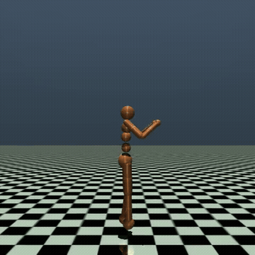
    </td>
    <td align="center"><strong>Final policy</strong><br>
      
    </td>
  </tr>
  <tr>
    <td align="center"><strong>Best model — episode A</strong><br>
      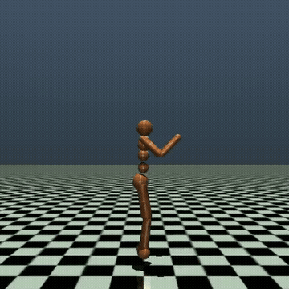
    </td>
    <td align="center"><strong>Best model — episode B</strong><br>
      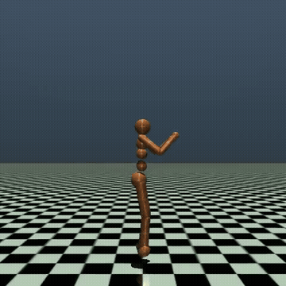
    </td>
  </tr>
</table>

### Training progression (post-Zoo-config fix)

Snapshots every ~2.5M steps from init to 50M steps, after switching to
the Zoo hyperparameters + `VecNormalize`.

<table>
  <tr>
    <td align="center"><sub>2.5M steps</sub><br>
      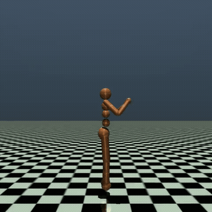
    </td>
    <td align="center"><sub>10M steps</sub><br>
      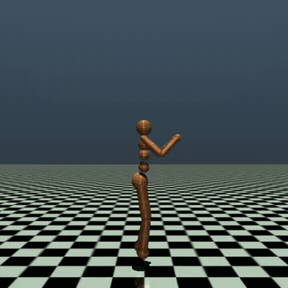
    </td>
    <td align="center"><sub>17.5M steps</sub><br>
      
    </td>
  </tr>
  <tr>
    <td align="center"><sub>25M steps</sub><br>
      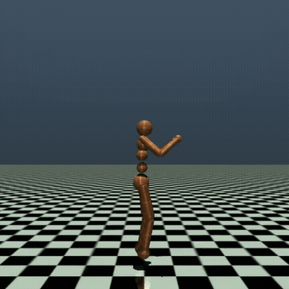
    </td>
    <td align="center"><sub>32.5M steps</sub><br>
      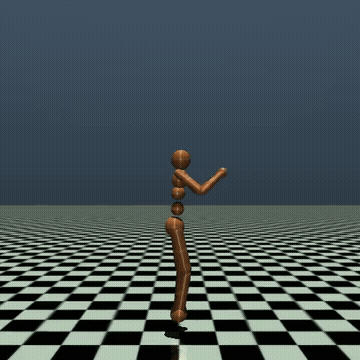
    </td>
    <td align="center"><sub>40M steps</sub><br>
      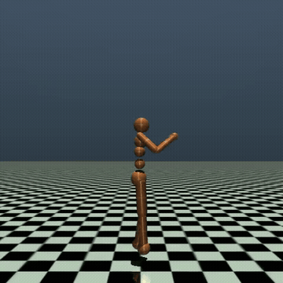
    </td>
  </tr>
  <tr>
    <td align="center"><sub>47.5M steps</sub><br>
      
    </td>
    <td align="center"><sub>50M steps</sub><br>
      
    </td>
    <td></td>
  </tr>
</table>

<details>
<summary>Two-episode comparisons at each checkpoint (click to expand)</summary>

<table>
  <tr>
    <td align="center"><sub>2.5M · ep A</sub><br>
      
    </td>
    <td align="center"><sub>2.5M · ep B</sub><br>
      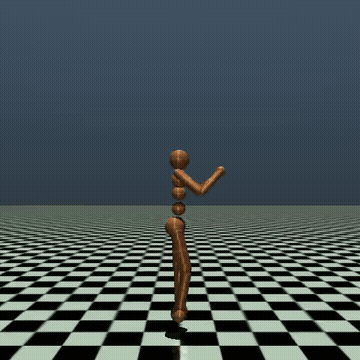
    </td>
    <td align="center"><sub>10M · ep A</sub><br>
      
    </td>
    <td align="center"><sub>10M · ep B</sub><br>
      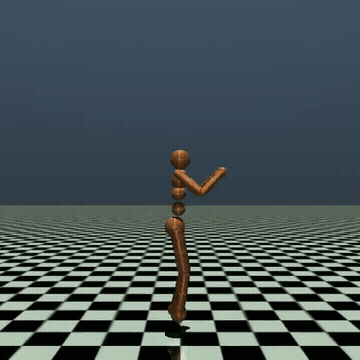
    </td>
  </tr>
  <tr>
    <td align="center"><sub>17.5M · ep A</sub><br>
      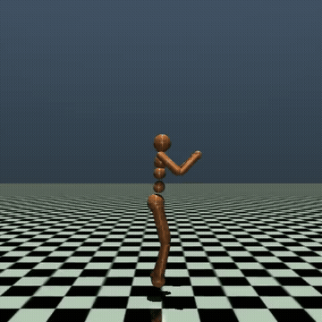
    </td>
    <td align="center"><sub>17.5M · ep B</sub><br>
      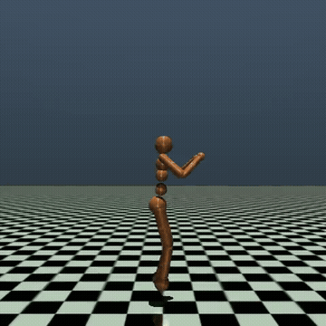
    </td>
    <td align="center"><sub>25M · ep A</sub><br>
      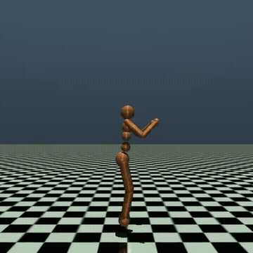
    </td>
    <td align="center"><sub>25M · ep B</sub><br>
      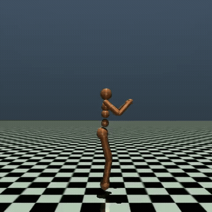
    </td>
  </tr>
  <tr>
    <td align="center"><sub>32.5M · ep A</sub><br>
      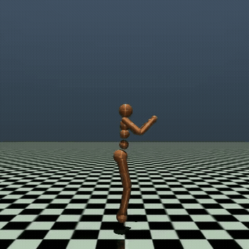
    </td>
    <td align="center"><sub>32.5M · ep B</sub><br>
      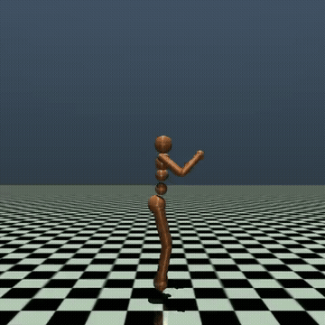
    </td>
    <td align="center"><sub>40M · ep A</sub><br>
      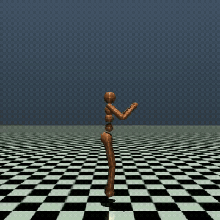
    </td>
    <td align="center"><sub>40M · ep B</sub><br>
      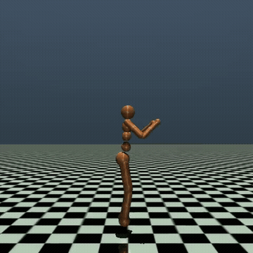
    </td>
  </tr>
  <tr>
    <td align="center"><sub>42.5M · ep A</sub><br>
      
    </td>
    <td align="center"><sub>42.5M · ep B</sub><br>
      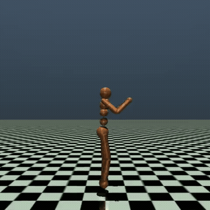
    </td>
    <td></td>
    <td></td>
  </tr>
</table>

</details>

### The pre-Zoo plateau run

This is the first local run — **default hyperparameters, no
`VecNormalize`**. It plateaus at ~650 reward and stays there. Watch how
the shuffle never becomes a walk.

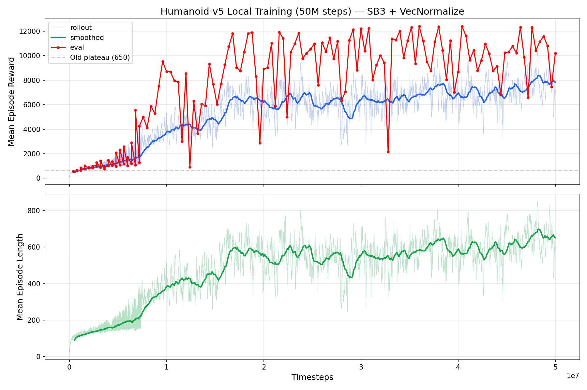

<table>
  <tr>
    <td align="center"><sub>0 steps (random init)</sub><br>
      
    </td>
    <td align="center"><sub>26M steps</sub><br>
      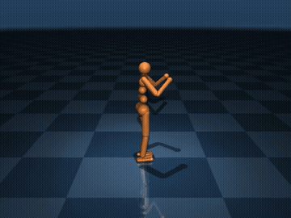
    </td>
    <td align="center"><sub>53M steps</sub><br>
      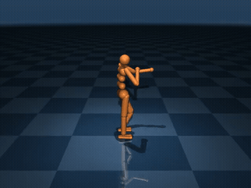
    </td>
  </tr>
  <tr>
    <td align="center"><sub>79M steps</sub><br>
      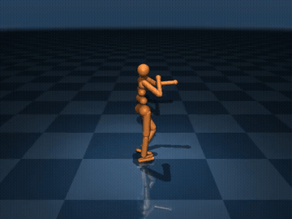
    </td>
    <td align="center"><sub>106M steps</sub><br>
      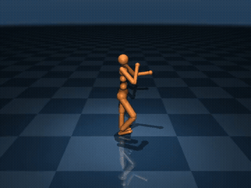
    </td>
    <td align="center"><sub>132M steps</sub><br>
      
    </td>
  </tr>
  <tr>
    <td align="center"><sub>159M steps</sub><br>
      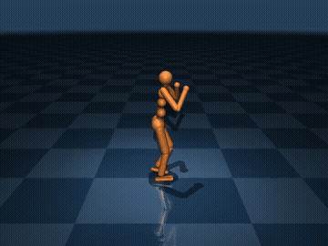
    </td>
    <td align="center"><sub>185M steps</sub><br>
      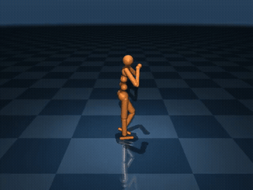
    </td>
    <td></td>
  </tr>
</table>

---

## Case Study 2 — Lambda Brax + MJX + A100

MuJoCo XLA compiles the physics to GPU; Brax runs the entire training
loop (env step → rollout → GAE → minibatch SGD) under JIT on-device,
with **4,096 parallel humanoids**. Net throughput ~130,000 steps/sec —
a 37× speedup over the local pipeline.

Higher raw reward numbers, but — as the videos show — the gait quality
is _worse_ than the local run. The policy finds a "speed skater"
exploit: torso forward, arms behind for balance, one leg as a rudder,
front leg pumping as fast as possible. It looks nothing like walking,
but it maximises forward velocity.

### Lambda v2 — vanilla reward over 766M steps

Peak reward **18,052** at step 766,771,200. Notice how the gait gets
progressively more extreme as the policy leans further into the
reward-hack.

<table>
  <tr>
    <td align="center"><sub>0 (random init)</sub><br>
      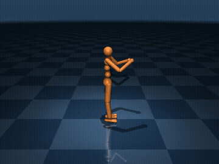
    </td>
    <td align="center"><sub>51M steps</sub><br>
      
    </td>
    <td align="center"><sub>102M steps</sub><br>
      
    </td>
    <td align="center"><sub>153M steps</sub><br>
      
    </td>
  </tr>
  <tr>
    <td align="center"><sub>204M steps</sub><br>
      
    </td>
    <td align="center"><sub>255M steps</sub><br>
      
    </td>
    <td align="center"><sub>306M steps</sub><br>
      
    </td>
    <td align="center"><sub>357M steps</sub><br>
      
    </td>
  </tr>
  <tr>
    <td align="center"><sub>408M steps</sub><br>
      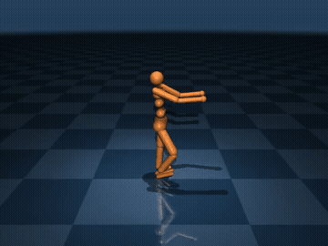
    </td>
    <td align="center"><sub>460M steps</sub><br>
      
    </td>
    <td align="center"><sub>511M steps</sub><br>
      
    </td>
    <td align="center"><sub>562M steps</sub><br>
      
    </td>
  </tr>
  <tr>
    <td align="center"><sub>613M steps</sub><br>
      
    </td>
    <td align="center"><sub>664M steps</sub><br>
      
    </td>
    <td align="center"><sub>715M steps</sub><br>
      
    </td>
    <td align="center"><sub><strong>766M — peak 18,052</strong></sub><br>
      
    </td>
  </tr>
  <tr>
    <td align="center"><sub>817M steps (post-NaN recovery)</sub><br>
      
    </td>
    <td></td><td></td><td></td>
  </tr>
</table>

### Lambda v3 vs v4 — reward shaping vs reward hacking

To fight the speed-skater gait, v3 added an upright-torso bonus and a
left/right symmetry penalty. v4 stacked on arm and abdomen penalties
plus a forward-lean penalty. v4 looks more upright, but the policy
still finds new loopholes (e.g. one-leg skating that technically
satisfies left/right symmetry because the moving leg swaps sides every
few frames).

<table>
  <tr>
    <td></td>
    <th>v3 — upright + symmetry</th>
    <th>v4 — + arm / abdomen / lean</th>
  </tr>
  <tr>
    <td align="center"><sub>10M steps</sub></td>
    <td align="center"></td>
    <td align="center">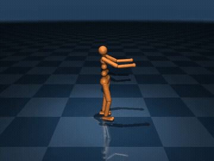</td>
  </tr>
  <tr>
    <td align="center"><sub>20M steps</sub></td>
    <td align="center"></td>
    <td align="center"></td>
  </tr>
  <tr>
    <td align="center"><sub>31M steps</sub></td>
    <td align="center"></td>
    <td align="center"></td>
  </tr>
  <tr>
    <td align="center"><sub>41M steps</sub></td>
    <td align="center"><em>(diverged)</em></td>
    <td align="center"></td>
  </tr>
  <tr>
    <td align="center"><sub><strong>52M — peak 18,715 (v4)</strong></sub></td>
    <td align="center"></td>
    <td align="center"></td>
  </tr>
  <tr>
    <td align="center"><sub>62M steps</sub></td>
    <td align="center"></td>
    <td align="center"></td>
  </tr>
  <tr>
    <td align="center"><sub>72M steps</sub></td>
    <td align="center"></td>
    <td align="center"></td>
  </tr>
</table>

---

## Reproduce

You'll want two virtual environments — the two pipelines have different
Python/JAX/PyTorch combinations:

1. `.venv/` — Python 3.10, JAX + Brax + MuJoCo-MJX (Lambda GPU training
   + video rendering from MJX checkpoints)
2. `local/.venv/` — Python 3.11, Stable-Baselines3 + PyTorch (local CPU
   training)

### Case study 1 — Local (SB3 + CPU)

```bash
cd local
python3.11 -m venv .venv
source .venv/bin/activate
pip install -r requirements.txt

# Fresh training (caffeinate keeps the laptop awake)
caffeinate -i python3 train.py

# Resume from a checkpoint
caffeinate -i python3 train.py --resume checkpoints/<ckpt>.zip

# Record snapshot videos during/after training
python3 snapshots.py
```

Hyperparameters (Zoo-tuned) are in `local/config.yaml`. The full
plateau→fix diff lives in `local/CHANGES.md`.

### Case study 2 — Lambda (Brax + MJX)

1. Copy the env template and fill it in:

    ```bash
    cp .env.example .env
    $EDITOR .env
    ```

    You need:
    - **`LAMBDA_API_KEY`** — [cloud.lambda.ai → API Keys](https://cloud.lambda.ai/api-keys)
    - **`SSH_KEY_NAME`** + **`SSH_KEY_PATH`** — public key added at
      [cloud.lambda.ai → SSH Keys](https://cloud.lambda.ai/ssh-keys),
      matching private key on your machine
    - **`LAMBDA_FILESYSTEM_NAME`** / **`LAMBDA_FILESYSTEM_ID`** /
      **`LAMBDA_FILESYSTEM_MOUNT`** _(optional but strongly
      recommended)_ — a persistent filesystem so your venv +
      checkpoints survive between spot instances. Create one at
      [cloud.lambda.ai → Filesystems](https://cloud.lambda.ai/filesystems).
      Filesystems are regional — `lambda_run.sh` will only launch in
      the filesystem's region when this is set.

2. Local root venv (for rendering + ad-hoc scripting):

    ```bash
    python3.10 -m venv .venv
    source .venv/bin/activate
    pip install -r requirements.txt
    ```

3. Launch training:

    ```bash
    bash check_availability.sh          # see what GPUs are up right now
    bash lambda_run.sh                  # fresh start
    bash lambda_run.sh --resume         # resume from last FS checkpoint
    ```

    `lambda_run.sh` picks the cheapest available single-GPU instance
    (A10 → A100 → H100 → GH200 → B200 → 8xV100, in that order), uploads
    the code, sets up the venv (reusing a persistent-FS venv if
    available), starts `train.py` under `nohup`, rsyncs checkpoints +
    logs back every 10 minutes, and terminates the instance once
    training finishes.

4. Hyperparameters are in `config.yaml`. Reward function variants
   (vanilla, v3, v4) are in `train.py`.

### Render videos from any MJX checkpoint

```bash
source .venv/bin/activate

# Single checkpoint
python render_mjx.py checkpoints_v4/step_051609600

# Entire run → an output dir
python render_mjx.py checkpoints_v4/ --output videos_v4

# Every 3rd checkpoint, 5 episodes each
python render_mjx.py checkpoints_v2/ --every 3 --episodes 5
```

> **⚠️ Why `render_mjx.py` exists:** MJX checkpoints can't be rendered
> with raw CPU MuJoCo — the `cinert`/`cvel` components of the
> observation differ between MJX and CPU MuJoCo physics, so a policy
> trained under MJX receives garbage inputs and falls over immediately.
> `render_mjx.py` runs the MJX env on CPU JAX (for correct
> observations), then copies `qpos`/`qvel` into CPU MuJoCo (for
> rendering frames).

---

## What didn't work (and why)

- **Default hyperparameters on local SB3** — plateaued at ~650 reward
  for 35M steps. The Optuna-tuned Zoo config broke past it in minutes,
  without any architecture change.
- **Zero entropy coefficient** — no exploration pressure, policy locks
  into local optima. Lifting to 2.4e-3 (SB3) / 1e-3 (Brax) is enough.
- **Unnormalized observations** — Humanoid's sensor values span 5+
  orders of magnitude; PPO can't learn stable representations without
  `VecNormalize` (SB3) / running-stats normalization (Brax).
- **`reward_scaling: 0.1` + no grad clipping (MJX)** — training NaN'd
  in 3 of 4 runs somewhere around 40–80M steps of fine-tuning.
  Dropping to 0.05 and clipping gradients at 1.0 extended runs
  substantially.
- **Hand-crafted gait rewards** — incremental. Each time we plug one
  loophole the policy finds another (e.g. v3 left/right symmetry
  penalty → v4 one-leg skating that alternates fast enough to satisfy
  symmetry while still being ridiculous). Natural locomotion is
  probably gated on reference-motion imitation.

---

## Further reading

- **[EXPLANATION.md](EXPLANATION.md)** — plain-English walkthrough of
  PPO, reward hacking, and the whole training journey
- **[docs/TECHNICAL.md](docs/TECHNICAL.md)** — full hyperparameters,
  reward functions, architecture, checkpoint formats, pipeline details
- [Stable-Baselines3 PPO docs](https://stable-baselines3.readthedocs.io/en/master/modules/ppo.html)
- [rl-baselines3-zoo](https://github.com/DLR-RM/rl-baselines3-zoo) —
  source of the Zoo hyperparameters that broke the plateau
- [Brax](https://github.com/google/brax) — JAX-native RL training loop
- [MuJoCo MJX](https://mujoco.readthedocs.io/en/stable/mjx.html) —
  MuJoCo physics compiled to GPU via XLA
- [DeepMimic](https://xbpeng.github.io/projects/DeepMimic/index.html) —
  reference-motion-imitation approach; the likely path to
  actually-natural walking

---

## License

No license file yet — treat this repo as "look but don't ship" until one
is added. Open an issue or PR if you'd like one (MIT is typical for
this kind of writeup).
