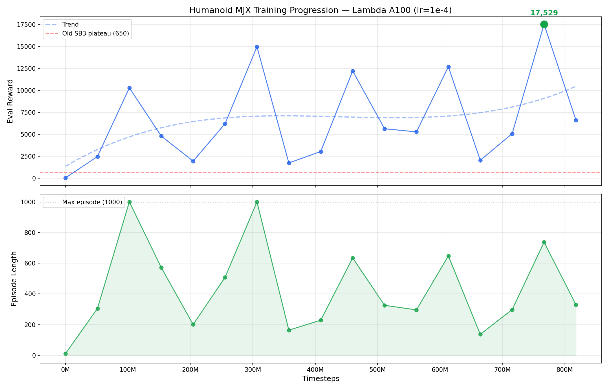

# humanoid-ppo

Teaching a MuJoCo humanoid to walk with PPO. Two pipelines — a MacBook
CPU for cheap iteration and a Lambda A100 for 37x faster turns —
documenting the plateau, the fix, the GPU blow-up, and the reward-hacking
gait the humanoid invented when we weren't looking.

<p align="center">
  <video src="https://github.com/EnesAkyuz/humanoid-ppo/raw/main/videos_v4/step_051609600.mp4" controls width="560" muted loop playsinline>
    Best v4 run (reward ≈ 18,715). If your viewer doesn't embed video,
    <a href="videos_v4/step_051609600.mp4">click here</a>.
  </video>
</p>

## TL;DR

- Trained from random init to **18,052 reward** on Humanoid-v5.
- A MacBook CPU plateaued at 650 reward for 35M steps.
  `VecNormalize` + Zoo-tuned hyperparameters unlocked 5,540+ in the first
  10M steps after the fix.
- Switching from SB3/CPU to Brax + MJX on an A100 was a **37x speedup**
  — 50M steps went from ~4 hours to ~6 minutes, letting us iterate on
  reward shaping in real time.
- The humanoid invented a lunge-slide gait that maximises forward
  velocity by stretching its arms behind like a speed-skater. v3/v4
  reward shaping made it more upright; truly natural walking likely
  needs imitation learning (DeepMimic-style).
- Full cost: ~**$3** of A100 time for the best run.

📖 **Plain-English walkthrough** of how PPO learns and what we tried:
[EXPLANATION.md](EXPLANATION.md)

📘 **Technical reference** (hyperparameters, architecture, pipeline):
[docs/TECHNICAL.md](docs/TECHNICAL.md)

---

## Results

| Run | Framework | Device | Peak Reward | Ep. Length | Steps | Wall Time |
|---|---|---|---|---|---|---|
| Local v1 (default config) | SB3 | M4 CPU | ~650 (plateau) | ~125 | 40M | ~12 h |
| Local v2 (Zoo config) | SB3 + VecNormalize | M4 CPU | 5,540+ | 536 | 10M | ~45 min |
| Lambda v1 (lr 3e-4) | Brax + MJX | A100 | 6,434 | — | 79M | ~12 min |
| **Lambda v2 (lr 1e-4)** | Brax + MJX | A100 | **18,052** | 737 | 766M | ~80 min |
| Lambda v3 (gait shaping v1) | Brax + MJX | A100 | 25,982 | 1000 | 20M | ~6 min |
| Lambda v4 (gait shaping v2) | Brax + MJX | A100 | 18,715 | 1000 | 51M | ~10 min |

_(v3 scores higher than v2 because the upright bonus adds to the raw
forward-velocity reward — the numbers aren't directly comparable across
reward functions.)_

### Training curves (Lambda v2)



---

## Videos

All clips are committed directly to the repo under `videos*/`. Click to
open in GitHub's video player.

### Lambda v2 — from zero to lunge

Vanilla Humanoid-v5 reward over 766M steps. Watch the agent go from
falling over to sprinting… while leaning forward like a speed skater.

| Step | Clip | Step | Clip |
|---|---|---|---|
| 0 (random init) | [▶](videos_v2/step_000000000.mp4) | 460M | [▶](videos_v2/step_460062720.mp4) |
| 51M (first balance) | [▶](videos_v2/step_051118080.mp4) | 511M | [▶](videos_v2/step_511180800.mp4) |
| 102M | [▶](videos_v2/step_102236160.mp4) | 562M | [▶](videos_v2/step_562298880.mp4) |
| 153M | [▶](videos_v2/step_153354240.mp4) | 613M | [▶](videos_v2/step_613416960.mp4) |
| 204M | [▶](videos_v2/step_204472320.mp4) | 664M | [▶](videos_v2/step_664535040.mp4) |
| 255M | [▶](videos_v2/step_255590400.mp4) | 715M | [▶](videos_v2/step_715653120.mp4) |
| 306M | [▶](videos_v2/step_306708480.mp4) | **766M — peak 18,052** | [▶](videos_v2/step_766771200.mp4) |
| 357M | [▶](videos_v2/step_357826560.mp4) | 817M (post-NaN recovery) | [▶](videos_v2/step_817889280.mp4) |
| 408M | [▶](videos_v2/step_408944640.mp4) | | |

### Reward shaping — v3 vs v4

v3 added an **upright-torso bonus** and **left/right symmetry penalty**.
v4 stacked on **arm and abdomen penalties** and a **forward-lean
penalty** to try to kill the speed-skater arms.

| Step | v3 (upright + symmetry) | v4 (+ arm/abdomen/lean penalties) |
|---|---|---|
| 10M | [▶](videos_v3/step_010321920.mp4) | [▶](videos_v4/step_010321920.mp4) |
| 20M | [▶](videos_v3/step_020643840.mp4) | [▶](videos_v4/step_020643840.mp4) |
| 31M | [▶](videos_v3/step_030965760.mp4) | [▶](videos_v4/step_030965760.mp4) |
| 41M | — | [▶](videos_v4/step_041287680.mp4) |
| **52M — peak 18,715** | — | [▶](videos_v4/step_051609600.mp4) |
| 62M | — | [▶](videos_v4/step_061931520.mp4) |
| 72M | — | [▶](videos_v4/step_072253440.mp4) |

### Local SB3 (CPU) progression

Early run on the MacBook before the Zoo config fix — see the plateau
in action.

| Step | Clip |
|---|---|
| 0 | [▶](videos/step_000000000.mp4) |
| 26M | [▶](videos/step_026419200.mp4) |
| 53M | [▶](videos/step_052838400.mp4) |
| 79M | [▶](videos/step_079257600.mp4) |
| 106M | [▶](videos/step_105676800.mp4) |
| 132M | [▶](videos/step_132096000.mp4) |
| 159M | [▶](videos/step_158515200.mp4) |
| 185M | [▶](videos/step_184934400.mp4) |

Post-Zoo-config snapshots live in
[`local/videos/snapshots/`](local/videos/snapshots/).

---

## Reproduce

You'll want two virtual environments (different versions of
MuJoCo/Python stacks):

1. `.venv/` (Python 3.10) — JAX + Brax + mujoco-mjx, for GPU training
   and video rendering
2. `local/.venv/` (Python 3.11) — Stable-Baselines3 + PyTorch, for CPU
   training

### Local training (MacBook, SB3 + CPU)

```bash
cd local
python3.11 -m venv .venv
source .venv/bin/activate
pip install -r requirements.txt

# Fresh training (keep the laptop awake)
caffeinate -i python3 train.py

# Resume from a checkpoint
caffeinate -i python3 train.py --resume checkpoints/<ckpt>.zip

# Record snapshot videos during/after training
python3 snapshots.py
```

Hyperparameters (Zoo-tuned) are in `local/config.yaml`. The plateau→fix
hyperparameter diff lives in `local/CHANGES.md`.

### GPU training (Lambda Cloud, Brax + MJX)

1. Copy the env template and fill it in:

    ```bash
    cp .env.example .env
    $EDITOR .env
    ```

    You'll need:
    - **`LAMBDA_API_KEY`** — create at
      [cloud.lambda.ai → API Keys](https://cloud.lambda.ai/api-keys)
    - **`SSH_KEY_NAME`** + **`SSH_KEY_PATH`** — add your public key at
      [cloud.lambda.ai → SSH Keys](https://cloud.lambda.ai/ssh-keys),
      then set `SSH_KEY_NAME` to the name you gave it and
      `SSH_KEY_PATH` to the matching private key on your machine
    - **`LAMBDA_FILESYSTEM_NAME`** + **`LAMBDA_FILESYSTEM_ID`** +
      **`LAMBDA_FILESYSTEM_MOUNT`** _(optional but strongly
      recommended)_ — create a persistent filesystem at
      [cloud.lambda.ai → Filesystems](https://cloud.lambda.ai/filesystems)
      so your venv and checkpoints survive between spot instances.
      Filesystems are regional; `lambda_run.sh` only launches instances
      in the filesystem's region when this is set.

2. Set up the root venv locally (for rendering and any ad-hoc
   scripting against the shared stack):

    ```bash
    python3.10 -m venv .venv
    source .venv/bin/activate
    pip install -r requirements.txt
    ```

3. Launch training:

    ```bash
    bash check_availability.sh          # see what GPUs are up right now
    bash lambda_run.sh                  # fresh start
    bash lambda_run.sh --resume         # resume from last checkpoint on FS
    ```

    `lambda_run.sh` picks the cheapest available single-GPU instance
    (A10 → A100 → H100 → GH200 → B200 → 8xV100, in that order), uploads
    the code, sets up the venv (or reuses the one on the filesystem),
    starts `train.py` under `nohup`, rsyncs checkpoints + logs back
    every 10 minutes, and terminates the instance once training
    finishes.

4. Hyperparameters are in `config.yaml`. Reward functions (vanilla,
   v3, v4) are in `train.py`.

### Render videos from a checkpoint

```bash
source .venv/bin/activate

# One checkpoint
python render_mjx.py checkpoints_v4/step_051609600

# Whole run
python render_mjx.py checkpoints_v4/ --output videos_v4

# Every 3rd checkpoint, 5 episodes each
python render_mjx.py checkpoints_v2/ --every 3 --episodes 5
```

> **⚠️ Why `render_mjx.py` exists:** MJX checkpoints can't be rendered
> with raw CPU MuJoCo — the `cinert`/`cvel` components of the
> observation differ between MJX and CPU MuJoCo physics, so the policy
> receives garbage inputs and falls over immediately. `render_mjx.py`
> runs the MJX env on CPU JAX for correct observations, then copies
> `qpos`/`qvel` to CPU MuJoCo for rendering frames.

---

## What didn't work (and why)

- **Default hyperparameters** — plateaued at ~650 reward for 35M
  steps. The Optuna-tuned Zoo config broke past it in minutes, without
  any architecture change.
- **Zero entropy coefficient** — no exploration pressure, policy locks
  into local optima. Lifting to 2.4e-3 (SB3) / 1e-3 (Brax) is enough.
- **Unnormalized observations** — Humanoid's sensor values span 5+
  orders of magnitude; PPO can't learn stable representations without
  running-stats observation normalization.
- **`reward_scaling: 0.1` + no grad clip on MJX** — training NaN'd in
  3 of 4 runs somewhere in 40–80M steps of fine-tuning. Dropping to
  0.05 and clipping gradients at 1.0 made runs last much longer.
- **Hand-crafted gait rewards** — incremental. The humanoid finds new
  loopholes each time (e.g. one-leg skating that technically satisfies
  left/right symmetry because the moving leg swaps sides). Natural
  locomotion is probably gated on reference-motion imitation.

---

## Further reading

- **[EXPLANATION.md](EXPLANATION.md)** — plain-English walkthrough of
  PPO, reward hacking, and the whole training journey
- **[docs/TECHNICAL.md](docs/TECHNICAL.md)** — full hyperparameters,
  reward functions, architecture, checkpoint formats, pipeline
  details
- [Stable-Baselines3 PPO](https://stable-baselines3.readthedocs.io/en/master/modules/ppo.html)
- [rl-baselines3-zoo](https://github.com/DLR-RM/rl-baselines3-zoo) —
  source of the Zoo hyperparameters that broke the plateau
- [Brax](https://github.com/google/brax) — JAX-native RL training loop
- [MuJoCo MJX](https://mujoco.readthedocs.io/en/stable/mjx.html) —
  physics compiled to GPU via XLA
- [DeepMimic](https://xbpeng.github.io/projects/DeepMimic/index.html) —
  the reference-motion-imitation approach that probably gets you
  actually-natural walking

---

## License

No license file yet — treat this repo as "look but don't ship" until
one is added. If you want a specific license (MIT is typical for this
kind of writeup), open an issue or add a `LICENSE` file.
